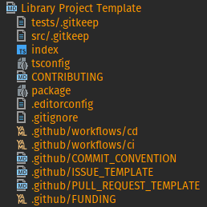

<!-- (c) João Lenon <lenon@secjs.com.br> -->

# Ws-Templates 📜

> My WebStorm templates (files, projects and libraries)

    

  

  

  

The intention behind this repository is to always maintain a `Template for WebStorm` to start new projects or libraries.

## Installation

> You can see above how I have configured this templates in my WebStorm. 
> [Click here to see JetBrains installation tutorial](https://www.jetbrains.com/help/idea/using-file-and-code-templates.html#syntax)

    

---

## License

Made with 🖤 by [jlenon7](https://github.com/jlenon7) :wave:
